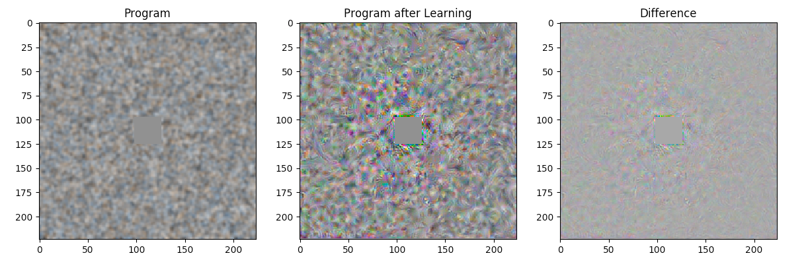

# Adversarial Reprogramming of Neural Networks

This is a PyTorch re-implementation for the ICLR'19 paper: 
[Adversarial Reprogramming of Neural Networks](https://openreview.net/pdf?id=Syx_Ss05tm) 
provided by : [kcelia 👩🏻‍💻](https://github.com/kcelia/) & [VieVie31 👨🏻‍💻](https://github.com/VieVie31/)





```
@inproceedings{
    elsayed2018adversarial,
    title={Adversarial Reprogramming of Neural Networks},
    author={Gamaleldin F. Elsayed and Ian Goodfellow and Jascha Sohl-Dickstein},
    booktitle={International Conference on Learning Representations},
    year={2019},
    url={https://openreview.net/forum?id=Syx_Ss05tm},
}
```


